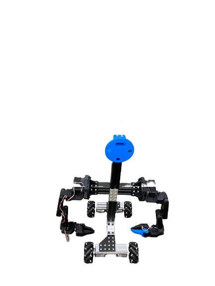

  <!-- Header -->
  <header style="text-align: center; margin-bottom: 20px;">
    <h1 style="font-size: 4.5rem; font-weight: 800; color: #000; margin-bottom: 10px; letter-spacing: -0.05em;">
      sHUMANOID v.1
    </h1>
    

      by Sanatan Sinha
    

  </header>

  <!-- Hero Image Section (Cropped from Top) -->
  

    
  

  

  <!-- SECTION 1: Deep Technical Overview -->
  <section style="max-width: 950px; margin: 0 auto 100px auto;">
    <h2 style="font-size: 2.8rem; font-weight: 700; color: #000; margin-bottom: 40px; text-align: center; letter-spacing: -0.03em;">
      Project Overview
    </h2>
    

      The <b>sHUMANOID v.1</b> is a high-performance mobile humanoid platform designed for advanced research in bimanual manipulation and omnidirectional navigation. Unlike traditional stationary systems, the sHUMANOID v.1 is engineered for a high degree of operational flexibility in complex human-centric environments. 
        
      The core design philosophy centers on a <b>bimanual setup</b>, integrating two <b>sROBOT v.1</b> robotic arms. This dual-arm configuration allows the robot to perform coordinated tasks such as heavy lifting, complex object handovers, and synchronized manipulation, mimicking human-level bi-manual capability. By utilizing the 7-axis dexterity of the sROBOT v.1 arms, the platform bypasses the kinematic constraints of simpler designs, enabling smooth and continuous motion paths for professional automation and motion-planning research.
    

  </section>

  <!-- SECTION 2: Structural Integrity & Mobility -->
  <section style="max-width: 950px; margin: 0 auto 100px auto; background: #fcfcfc; padding: 70px; border-radius: 24px; border: 1px solid #f1f1f1;">
    <h2 style="font-size: 2.5rem; font-weight: 700; color: #000; margin-bottom: 35px; text-align: left; letter-spacing: -0.02em;">
      Mechanical Framework & Navigation
    </h2>
    

      To support the dynamic forces generated by a bimanual system during high-torque manipulation, the <b>sHUMANOID v.1</b> features a chassis constructed entirely from <b>extruded aluminum</b> profiles. This industrial-grade framework provides the necessary rigidity and structural damping required for precision robotic operations while remaining modular for future sensor and actuator upgrades. 
        
      Mobility is achieved through a specialized <b>mecanum wheel</b> base. This omnidirectional drive system allows the sHUMANOID v.1 to strafe laterally and rotate in place with zero turning radius, providing unprecedented maneuverability in tight corridors or cluttered laboratory settings. The combination of a rigid aluminum spine and an agile mecanum base creates a robust foundation for mobile manipulation, ensuring that the <b>sROBOT v.1</b> arms can operate from a stable yet highly versatile platform.
    

  </section>

  <!-- Footer -->
  <footer style="margin-top: 150px; padding-top: 50px; border-top: 1px solid #eee; text-align: center; color: #aaa; font-size: 1.1rem; text-transform: uppercase; letter-spacing: 2px;">
    Created by Sanatan Sinha
  </footer>

